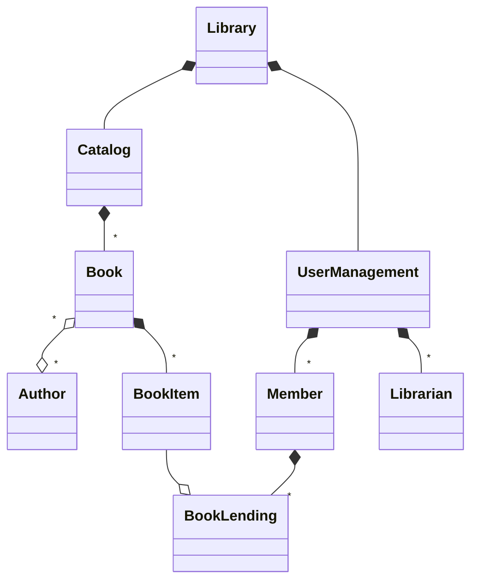

# データエンティティ

- 汎用的なデータ構造を使う
  - 配列やマップなど
- イミュータブル

## データエンティティ図

```mermaid
classDiagram
  class Author
  class Book
  class BookLending
  class Catalog
  class Librarian
  class Library
  class Member
  class UserManagement

  Library *-- Catalog
  Library *-- UserManagement

  Catalog *-- "*" Book
  Book "*" o--o "*" Author
  Book *-- "*" BookItem

  UserManagement *-- "*" Member
  UserManagement *-- "*" Librarian

  Member *-- "*" BookLending

  BookItem --o BookLending

```